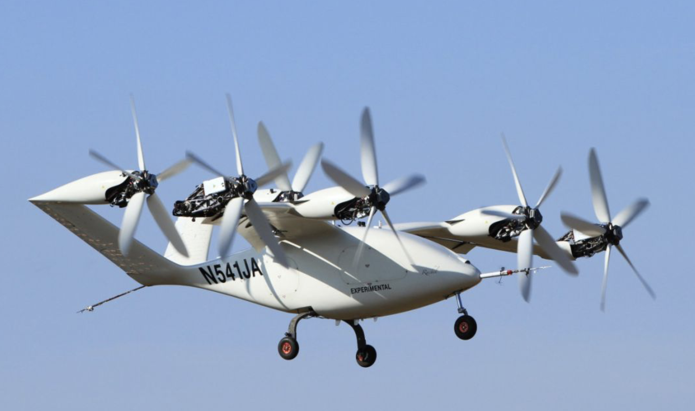

## Overview

Team of ~50–100 engineers over ~1 year.

**Goal:** demonstrate a full-scale eVTOL aircraft.

I worked on the manufacturing and structural testing of the airframe:

- Composites manufacturing of primary structure components
- Mechanical testing of structural assemblies

