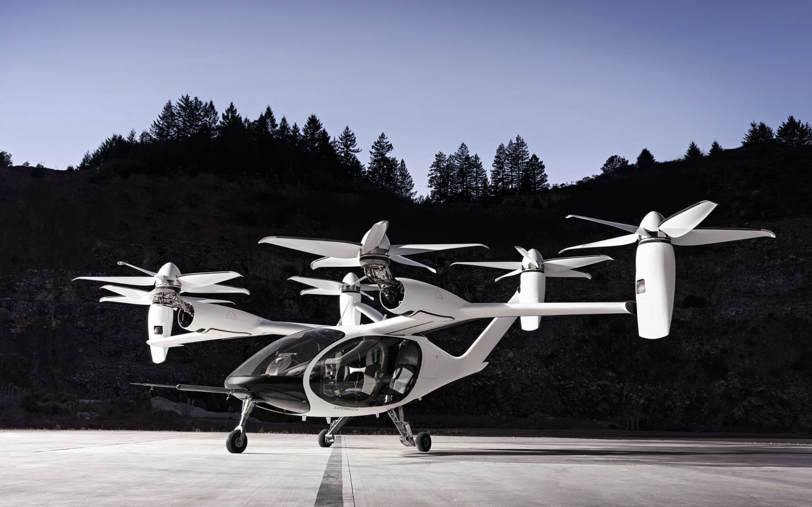

import YouTube from '../../../components/YouTube.astro';

## Overview

Team of ~100–300.

**Goal:** demonstrate system-level architecture for certification.

I was responsible for the tail and wing tip nacelles across the full development cycle:

- **Conceptual design** — contributed to aircraft architecture decisions
- **Design** — detailed design of nacelle structure and mechanisms
- **Build** — hands-on composite and mechanical assembly
- **Test** — ground structural and functional testing
- **Integration** — aircraft-level integration
- **Flight test** — flight test support campaign

<YouTube url="https://youtu.be/OAKCbpwmrgI?si=G8wT3AkFv3n3pZG4" />
