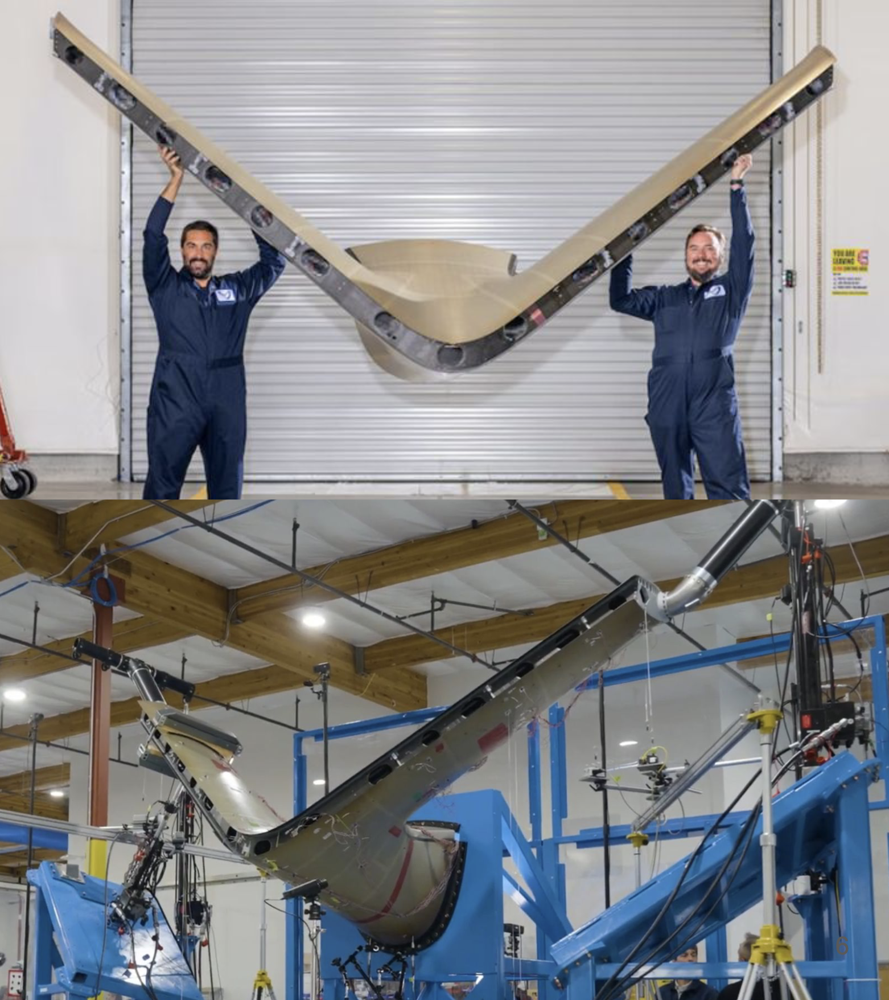
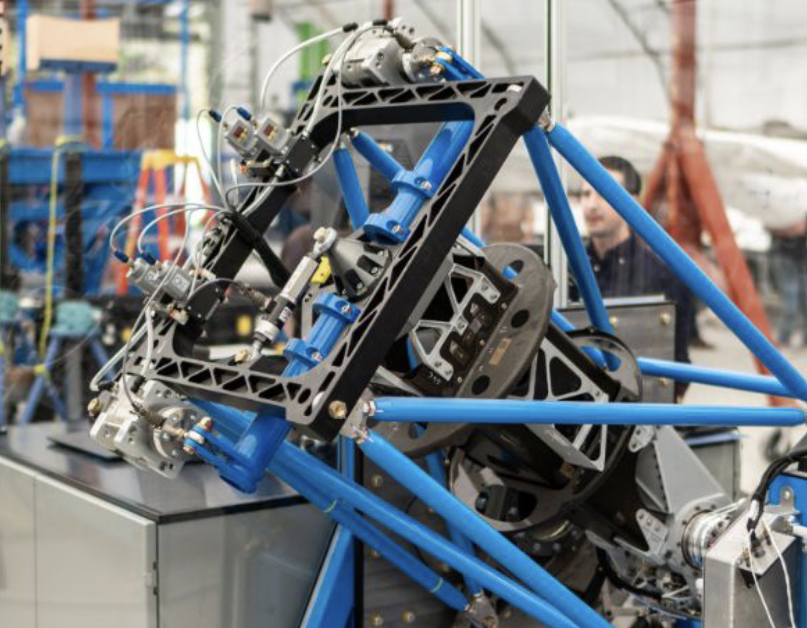
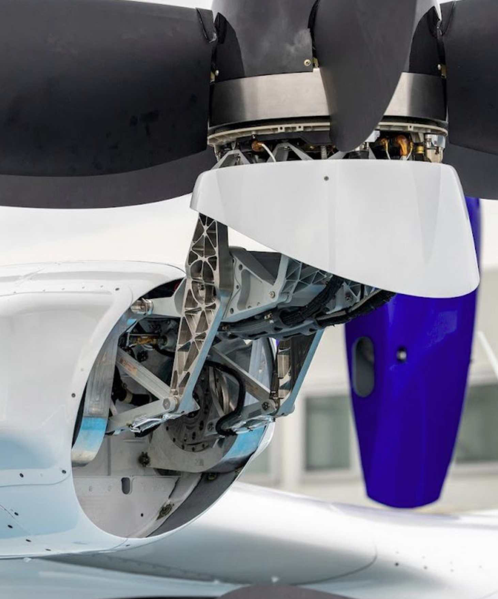

import YouTube from '../../../components/YouTube.astro';

## Overview

Team of ~300 to 2,000+ engineers across a multi-year program.

**Goal:** design and certify an eVTOL aircraft with a 4-passenger payload.

I led the Tail and Effectors Integrated Product Team with 5 direct reports.

### Tail

Clean sheet design to meet FAA requirements:

- Hand layup, AFP, and machined parts
- Met mass target
- Delivered production drawings
- Passed structural testing for FAA certification credit

### Effectors

- Nacelles (tilt mechanisms)
- Control surfaces
- Propellers

<YouTube url="https://youtu.be/eogSxX_yXcU?si=lMBKgpAfpNbGTlt4" />

{/* https://patents.google.com/patent/WO2025006314A2/en */}
