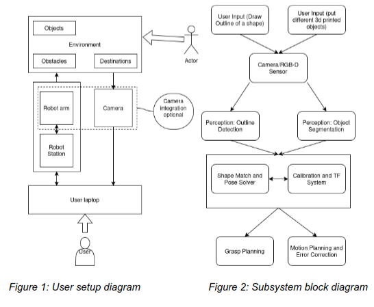

## Overview

This project used a Franka robot arm and an Intel RealSense camera to identify objects and match them to their corresponding targets. The physical setup includes a Franka arm, a RealSense camera, an ArUco tag mounted 0.3 m from the center of the robot’s base, and a white table holding a set of squares, rectangles, and cylinders. The RealSense camera detects the shapes on the table, classifies them, and determines the correct object–target pairings. Each target is a flat cross-section of an object.

The robot performs all pick-and-place actions using MoveIt 2 through the custom MoveIt API developed in Homework 3. It continues picking and placing objects until no targets remain. The system is robust to changes—objects or targets can be moved during operation, and the robot will still place each object correctly.

This project was done in a group with 4 members: Saif Ahmad, Aravind Ramaswami, Rob Zhu, and myself.

## Block diagram

## Role

My two main roles on this project were on the computer vision and the integration and debugging of the systems on the real robot.

The computer vision model used YOLO and was trained on a custom generated dataset. The goal is to be able to extend this approach to any shape desired for the use case. In our case, the training was done by generating a dataset of images of the desired shapes against a noisy background.

The integration and debugging was about piecing together the different components together: calibration, perception, motion-planning and task excecution.