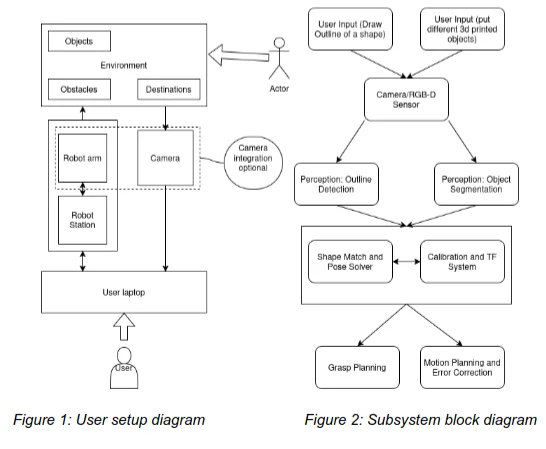

## Overview

A Franka arm and an Intel RealSense camera identify shapes (squares, rectangles, cylinders) on a table and place each onto its matching cross-section target. An ArUco fiducial tag, mounted 0.3 m from the robot base, calibrates camera-to-robot frames. The system runs until no targets remain and is robust to objects or targets being moved mid-task.

Pick-and-place commands are issued through MoveIt 2 via a custom API. Team: Saif Ahmad, Aravind Ramaswami, Rob Zhu, and myself.

## Block diagram

## Role

I owned the computer vision pipeline and the integration / debugging on the real robot.

The vision model uses You Only Look Once (YOLO), trained on a synthetic dataset of the target shapes rendered against noisy backgrounds — the approach extends to arbitrary shapes by regenerating the dataset.

Integration involved tying together calibration, perception, motion planning, and task execution into a single working system on hardware.
