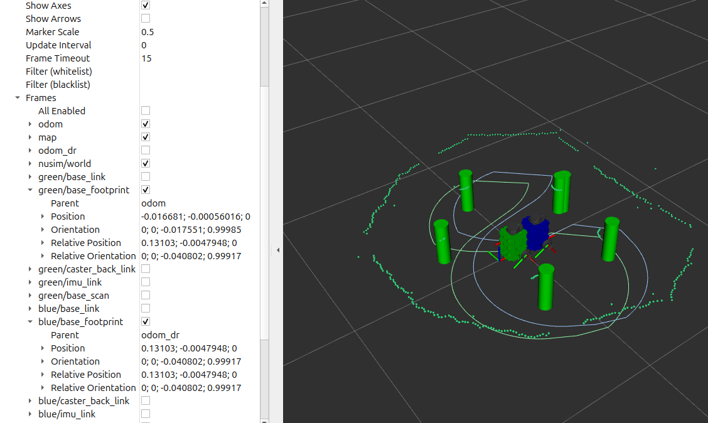

## Overview

Built a full SLAM stack from the ground up for a TurtleBot3 differential-drive robot in ROS 2. The robot uses a LIDAR to detect cylindrical landmarks and maintains a joint estimate of its own pose and all landmark positions.

The stack was cross-compiled for the TurtleBot3's ARM processor (aarch64) and deployed live on the robot.

## Packages

| Package | Role |
|---|---|
| `turtlelib` | 2D rigid-body transforms and differential-drive kinematics |
| `nusim` | ROS 2 simulator and visualizer for TurtleBot3 |
| `nuturtle_description` | URDF and robot description files |
| `nuturtle_interfaces` | Custom ROS 2 service definitions |
| `nuturtle_control` | Odometry, low-level control |
| `nuslam` | EKF SLAM with unknown data association |

## Odometry

Wheel encoder readings are integrated via the differential-drive kinematic model in `turtlelib` to estimate the robot's pose. Odometry accumulates drift over time, which the SLAM filter is designed to correct.

## SLAM in simulation

The `nuslam` package runs an EKF that maintains a joint state of the robot pose $(x, y, \theta)$ and all detected landmark positions $(m_{x_i}, m_{y_i})$. The filter supports two modes:

- **Known data association** — landmark IDs are provided directly by the simulator.
- **Unknown data association** — landmarks are matched to the existing map, with a distance threshold to initialize new landmarks.

RViz displays the ground-truth robot, the SLAM estimate, the odometry estimate, and the estimated and actual landmark positions simultaneously.

## SLAM in the real world

The filter was deployed on a physical TurtleBot3 navigating an environment of cylindrical landmarks. After a full loop, the SLAM estimate returned close to the origin while odometry had drifted significantly:

| Estimator | x (m) | y (m) | θ (rad) |
|---|---|---|---|
| **SLAM** | −0.016 | −0.001 | −0.018 |
| Odometry | 0.131 | −0.005 | −0.040 |

