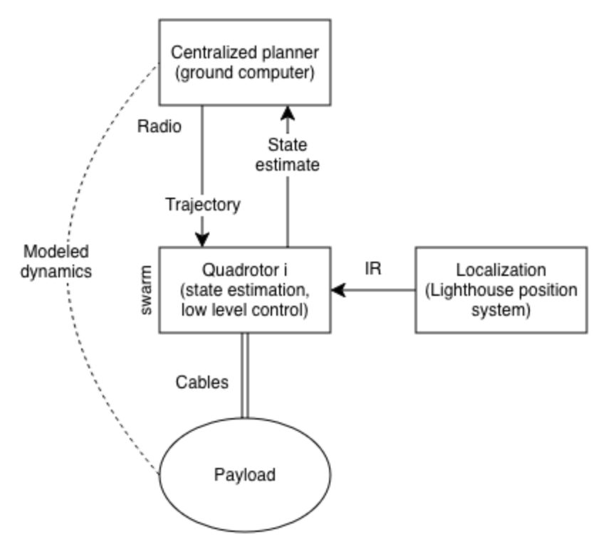

## Overview

Three Crazyflie 2.1 drones are each attached to the same payload by a cable and fly in coordinated formation. An OCP is solved offline using CasADi to find trajectories that simultaneously satisfy velocity, acceleration, jerk, cable tension, and obstacle constraints for all three drones. The solution is converted into 7th-degree polynomial segments compatible with the Crazyflie firmware, uploaded, and executed in a button-gated sequence (takeoff → align → fly → land).

The package covers the full workflow:

1. Define a payload reference path (ellipse, figure-8, straight line, random walk, or obstacle course).
2. Solve the OCP with CasADi to obtain per-drone trajectories that respect velocity, acceleration, jerk, cable tension, and obstacle constraints.
3. Convert the solution into 7th-degree polynomial segments compatible with the Crazyflie firmware.
4. Upload and execute the trajectories on real or simulated drones using Crazyswarm2.
5. Compare planned vs. executed trajectories using rosbag2 data.

## Video demonstration

[Watch the demo video](https://github.com/user-attachments/assets/08495a9e-1ff6-4af9-ac21-35a55d5e8173)

## Block diagram

